To Download the Latest CSET Release click here https://cset-download.inl.gov/

# CSET 11.x.x
 
Download CSET For Windows:
[CSET 11.X.X Standalone Installer](https://cset-download.inl.gov/)

What is CSET?
[CSET Overview](https://www.youtube.com/watch?v=B3xAh4iSRO0)

How Do I Use CSET?
[CSET Detailed Video](https://www.youtube.com/watch?v=ELbvQTl4xmU)

Older Versions of CSET For Windows:
[CSET 11.X.X Standalone Installer](https://github.com/cisagov/cset/releases/)


# Please note we do not use java and are not vulnerable to the log4j vulnerability.

-------------------------------------------------------------------------

File Checksum Integrity Verifier version 2.05.
csetstandalone.exe  

## License

MIT License, Apache License 2.0

Copyright 2018 Battelle Energy Alliance, LLC

See [License.txt](License.txt), and [NOTICE.txt](NOTICE.txt)

Contact information of authors: cset@hq.dhs.gov

Idaho National Laboratory, P.O. Box 1625, MS 3870, Idaho Falls, ID 83415

Includes software licensed under LGPL

LGPL dependencies are required to build CSET. You will be required to acquire them via nuGet in order to build this software. They are not distributed with this source.

## System Requirements

System Requirements Local Installation

It is recommended that users meet the minimum system hardware and software requirements prior to installing CSET. This includes:

• Pentium dual core 2.2 GHz processor (Intel x86 compatible)
• 6 GB free disk space
• 4 GB of RAM
• Microsoft Windows 10 or higher
• Microsoft .NET 7 Runtime (included in CSET installation)
• Microsoft ASP.NET Core 7 Runtime (included in CSET installation)
• Microsoft SQL Server 2022 LocalDB (included in CSET installation)

System Requirements Enterprise Installation

It is recommended that users meet the minimum system hardware and software requirements prior to installing CSET. This includes:

• Pentium dual core 2.2 GHz processor (Intel x86 compatible)
• 8 GB free disk space
• 4 GB of RAM
• Microsoft Windows Server 2016 Edition or higher recommended
• Microsoft .NET 7 Runtime
• Microsoft ASP.NET Core 7 Runtime
• Microsoft SQL Server 2022 or higher recommended
• Internet Information Server (IIS) or Kestrel

Other Items of Note:
• For all platforms, it is recommended the user upgrade to the latest Windows Service Pack and install critical updates available from the Windows Update web site to ensure the best compatibility and security.

## Using the CSET Stand-alone Installer

Double-click on the CSETStandAlone program.

The User Account Control dialog will appear (Fig.1). Select &quot;Yes&quot;.

![User account control dialog][fig1]

**Figure 1: User Account Control Box**

A CSET dialog will open asking if you want to install the CSET Desktop (Fig.2). Select &quot;Yes&quot;.

![Install dialog][fig2]

**Figure 2: Install Dialog**

The program will begin extracting.

After the extraction is finished, a CSET Setup dialog will open (Fig.3). Select &quot;Install&quot;.

![CSET setup dialog][fig3]

**Figure 3. CSET Setup**

CSET will begin to install. If the user doesn&#39;t have SQL Server 2022 LocalDB, CSET will install it. The SQL Server 2022 LocalDB Setup dialog will open (Fig.4). Click the check box to confirm that you &quot;…accept the terms in the License Agreement&quot;, select &quot;Next&quot;, and then select &quot;Install&quot;.

![LocalDB 2022 setup dialog][fig4]
 
**Figure 4. LocalDB 2022 Setup**

LocalDB 2022 will install. Select &quot;Finish&quot; when it completes.

CSET will also install the .NET 7 and ASP.NET Core 7 runtimes in the background if they are not already installed.

The CSET Setup Wizard will open to walk the user through the install process (Fig.5). Select &quot;Next&quot;.

![Setup wizard dialog][fig5]

**Figure 5: Setup Wizard**

A disclaimer will open (Fig.6). Read through and then click the box &quot;I read the disclaimer&quot;, and select &quot;Next&quot;.

![Disclaimer dialog][fig6]
 
**Figure 6: Disclaimer**

CSET will choose a default folder to install CSET to, but you can change this in the Destination Folder dialog (Fig.7). Select &quot;Next&quot;.

![Install destination dialog][fig7]
 
**Figure 7: Destination Folder**

The CSET Installer will show that it is ready to install (Fig. 8). Select &quot;Install&quot;.

![Ready to install dialog][fig8]
 
**Figure 8: Ready to Install**

The installation of the main CSET application will begin. Once the installation is finished, the completed CSET Setup Wizard dialog will appear. Make sure the &quot;Launch CSET when setup exists&quot; box is checked, and select &quot;Finish&quot;.

![Completed CSET setup wizard dialog][fig9]
 
**Figure 9: Completed CSET Setup Wizard**

The user should see a setup successful dialog (Fig.10).

![Setup successful dialog][fig10]
 
**Figure 10: Setup Successful**

The user has access to CSET as Local User. The Local Installation ribbon is visible at the top of the screen. They can see their landing page with no assessments at this time (Fig.11).

![Local install landing page][fig11]

Figure 11: Local Install Landing Page

[fig1]: img/fig1.png
[fig2]: img/fig2.png
[fig3]: img/fig3.png
[fig4]: img/fig4.png
[fig5]: img/fig5.png
[fig6]: img/fig6.png
[fig7]: img/fig7.png
[fig8]: img/fig8.png
[fig9]: img/fig9.png
[fig10]: img/fig10.png
[fig11]: img/fig11.png

<br/>
<br/>
<br/>


## CSET Enterprise Installation Instructions

### Introduction
This documentation is provided to assist users in navigating the basics of the CSET® Enterprise Edition for use on Windows Server. Here users will find step-by-step directions for installation, configuration, and setup, as well as links to various resources to assist in this process.

### Using the Provided Setup Script
The enterprise installation can be automated through the use of a provided PowerShell script named ```setup_enterprise.ps1``` (as of CSET release v11.0.1.2). This script is located in the root of the enterprise binaries zip folder.

1. Extract the CSET enterprise binaries to a desired location on your computer.

2. Search for PowerShell from the Windows Start menu. Right-click on Windows Powershell then click "Run as administrator."

 
<br/>

3. Navigate to the extracted CSET binaries folder. In this example, the folder is located on the user desktop. The PowerShell command to navigate to the desktop directory would be: <br/>
 ```cd C:\users\%USER%\Desktop\CSETv%VERSION%_Enterprise_Binaries```.

4. To run the setup script in the enterprise binaries directory, type ```.\setup_enterprise``` and hit the enter key.

5. The script will open the installation wizards for SQL Server Express 2022 and the .NET 7 Hosting Bundle. The script will not proceed to each subsequent installation step until each installation wizard window is closed. It will also install IIS and IIS Manager in the background.

 
<br/>

6. The script will then prompt for the creation of a password for the new CSET service user.

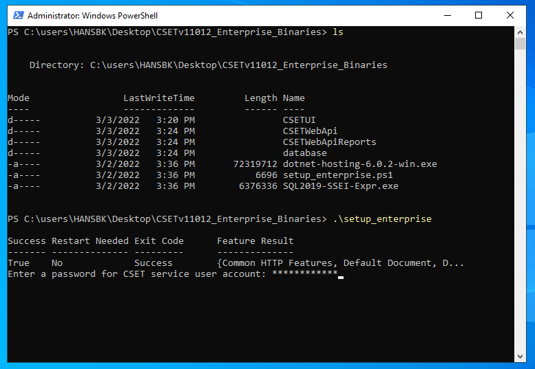
<br/>

7. The script will create the application pools and sites necessary for hosting CSET in IIS. Next, the script will prompt for the SQL server name to be used for the database setup. This name will likely be in the following format: <br/> 
```%COMPUTERNAME%\SQLEXPRESS```


<br/>

8. Once the script finishes its execution, open IIS Manager and browse the CSETUI site to begin using CSET.

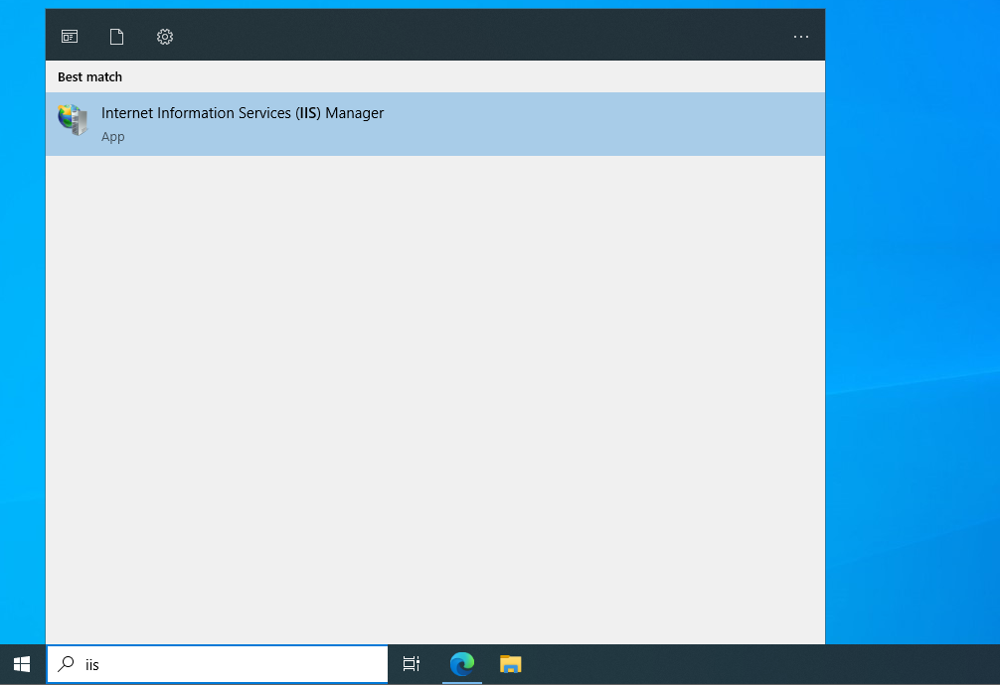
<br/>


<br/>

### Manual Setup

### Prerequisites & Necessary Files
1.	Download the CSET Enterprise Files from the [CSET® releases page](https://github.com/cisagov/cset/releases). Click the "CSETvXXXX_Enterprise_Binaries.zip" file to download it. Once the download is complete, you will need to unzip the folder. This folder includes the CSET® application binaries, as well as the required installation packages listed in prerequsites 2-4.

2.	We will be using Microsoft SQL Server 2022 for this setup. If you need to, you can download the [Express version from Microsoft directly](https://www.microsoft.com/en-us/download/details.aspx?id=101064).
  
3.	CSET® requires your server to have the URL Rewrite Module installed as well. Again, this can be downloaded [directly from Microsoft](https://www.iis.net/downloads/microsoft/url-rewrite) (Note that this module cannot be installed until IIS has been installed first. The process for installing IIS is explained in the next section).
  
4. CSET® requires the ASP.NET Core 7 and .NET 7 runtimes to run successfully. It is recommended to install these using the .NET 7 Hosting Bundle, which includes both of these runtimes and IIS support. This can be downloaded [directly from Microsoft](https://dotnet.microsoft.com/en-us/download/dotnet/7.0).

5.	If you are using a SQL Server, download and install Microsoft [SQL Server Management Studio (SSMS)](https://docs.microsoft.com/en-us/sql/ssms/download-sql-server-management-studio-ssms?view=sql-server-ver15).


### Installing IIS
1.	On your Windows Server, open the “Server Manager” application.

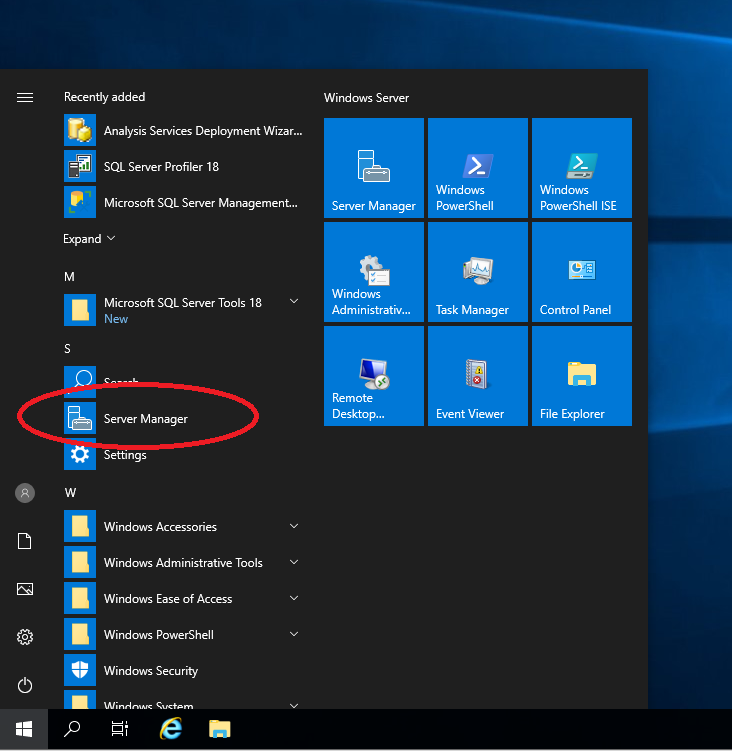 
<br/>

2.	Click “Add Roles and Features.” This should open the Roles and Features Wizard that will guide you through the installation process. 

<br/>

  * Installation Type – This should default to “Role-based or feature-based installation.” If it does not, please select this option.
  * Server Selection – Choose the server you plan on running CSET® on.
  * Server Roles – Select the “Web Server (IIS)” check box. Add any features the program prompts you for.
  * Features – The defaults will work just fine for running CSET®, however you may add any additional features you wish.
  * Web Server Role (IIS) – Click “Next.”
  * Role Services – Under Common HTTP Features, select “HTTP Redirection.”
  * Confirmation – Click “Install”. Close out of the Wizard when installation is complete.

  3. It may be necessary to create a new IIS Application Pool for your CSET Installation to run properly. When setting up the application in IIS, create a new Application Pool for CSET and give it the identity of the account you want to access the SQL Server with. Provided below are links to the official Microsoft documentation for this process.
  * To read more about IIS Application Pool creation click [here](https://docs.microsoft.com/en-us/iis/configuration/system.applicationhost/applicationpools/).
  * To read more about Pool Identification click [here](https://docs.microsoft.com/en-us/iis/manage/configuring-security/application-pool-identities).

<br/>

### SQL Server Installation
1.	To begin the process of installing a new SQL Server on your machine (see below): 
  * Open Microsoft’s “SQL Server Installation Center” 
  * On the left, select “Installation” 
  * Click “New SQL Server stand-alone installation” 

  <br/>

  * Input your product key (if needed) and accept the licensing terms to continue the installation.
  * The defaults for most of the sections will be just fine. However, the two sections you will need to modify are “Feature Selection” and “Database Engine Configuration.”
  * Feature Selection (see below) – When you are prompted to select specific server features, check the “Database Engine Services” box and then continue.

    

  * Database Engine Configuration (see below) – At the Database Engine Configuration screen, select the “Mixed Mode (SQL Server authentication and Windows authentication)” option.
  * Under the same section, you will be asked to create and input a password for the system administrator account. Make sure to remember this information!
  * Finally, click the Add Current User button at the bottom. This will populate your current windows account as a user. Once that is complete, click “Next.”

    

  * The final step is to click the Install button to finish up this process. Once this is complete, you can close out of the Server Setup window.

2. Once your server is up and running, you will need to install the URL Rewrite Module and the .NET 7 Runtimes. Simply download the installation media files from Microsoft (see Page 2 links or above hyperlink) and run them to install the necessary patches.

### Firewall Configuration
1. Open Windows Defender Firewall

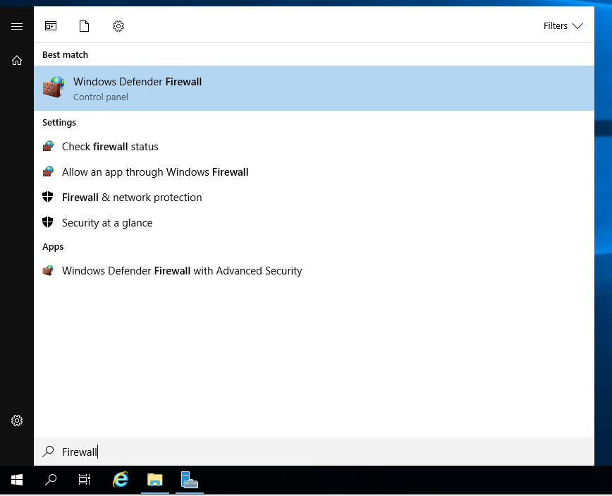

2.	On the left, select “Advanced Settings.”
  * Inside the new window, double-click “Inbound Rules” and then select “New Rule” on the right (see below).

  

  * Rule Type – Select “Port” as the new rule type and click “Next.”
  * Protocol and Ports (see below) – Change the rule to apply to “Specific local ports” and enter your desired port. Once that is finished, click “Next.”

  

  * Action – Select the “Allow the connection” radio button. This should be selected by default. Click “Next.”
  * Profile – Choose what type of networks you wish to allow connections from. If you are unsure, leave them all checked. Click “Next.”
  * Name – The final step is to create a name and description for this new rule. Once you’ve done this, click “Finish.”

### Database Setup
1.	Open the CSET® Enterprise Binaries folder that you downloaded earlier and navigate to the “database” subfolder. Inside this folder you will find two files called “CSETWebXXXX” and “CSETWebXXXX_log.” Copy these two files to your server.

2.	Open Microsoft SQL Server Management Studio (see below) and connect to the SQL Server that we setup previously. 
  * Open the “Connect to Server” dialog box.

  

  * Change the server name to “localhost” or whatever name you have specified for your server already.
  * Your Server can be run through either the “SQL Server Authentication,” which will require the login information you created earlier, or you can use the Windows Authentication, which will not require any login information as the server will verify your identity through your Windows account.

  

3.	Inside the Object Explorer on the left, right-click the Database folder (see below) and then click “Attach.”


  * This will bring up the “Attach Databases” dialog box (see below). Click the Add button and navigate to the location where you previously saved/copied the CSETWeb.mdf file. Click on the file and then click “OK,” and then click “OK” again to attach the database.

  

  * You’ll know you’ve completed this step successfully when you can see the “CSETWeb” object appear under the Databases section in the Object explorer.

  

### Create Database User
1. Peviously we created our SQL Server account. We will now need to create an account that has access to the database. Continuing in the Object Explorer, right-click on the folder named Security, hover over New (see below) and then click “Login.”

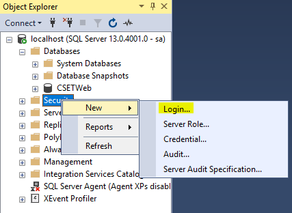

  * In the next window (see below), enter a login name, select the “SQL Server authentication” radio button, and then enter a password. If you choose to go through the Windows authentication, you will not need to enter a password.
  * At the bottom of the box, change the Default database to CSETWeb.

  

  * At top-left from the window shown below, click “User Mapping” and then select the CSETWeb checkbox. Then click “OK.”

  

2.	Back in the Object Explorer of SSMS (see below), expand the CSETWeb list, followed by Security and then Users. You should see the new user you created listed here. For us, it’s simply “user”. Right-click on your user’s name and select properties.


  * In the dialog box that pops up, select “Securables” from the menu on the left if it is not already selected.
  * Click the Search button to generate another dialog box. Make sure the “Specific objects…” radio button is selected and then click “OK.”

  

  * Once you hit OK, you should see yet another box pop-up titled “Select Object.” Click the button that says Object Types… This will generate a list of object types. Scroll down until you see the “Schemas” object (see below). Check this box, and then click “OK.”

  

  * Next, click "Browse" and select the "dbo" checkbox. Then click "Ok".

  

  * Once we have our dbo inside our Securables, we need to grant it permissions. Scroll through the list of permissions and when you find the "Execute" permission, select the "Grant" checkbox.

  

  * Our final step is to go over to the Membership page (see below) and select the checkboxes for “db_datareader” and “db_datawriter.” Then select “OK.”

  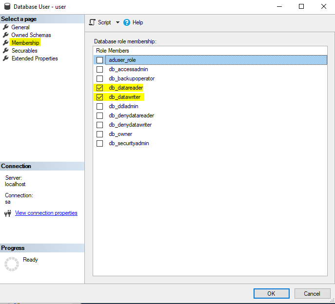

### CSET Installation
1.	Re-open Windows Server Manager (see below). Double-click on “IIS” on the left. Then, right-click on the server name and click “Internet Information Services (IIS) Manager.”


  * As seen in the picture below, expand the server’s name drop-down list and then expand the Sites drop down list. You should see a “Default Web Site” item. Right-click this item and select “Explore”. This will open the “wwwroot” folder.
  
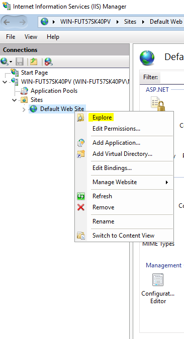
  
  * Delete everything inside this folder. 
  * If you’ve done any kind of changes or work inside this folder previously, we recommend copying the contents to preserve those changes as deleting the files will erase any changes you have made.
  * Copy the "CSETUI" and "CSETWebApi" folders from inside the CSET® Enterprise Binaries folder you downloaded and place them into your "wwwroot" folder.
  * You can add two additional websites (i.e. one to host the front-end application called CSETUI and one to host the back-end api called CSETWebApi) and point the physical paths to their respective folders located in "wwwroot." Ensure that the backend site is assigned to an application pool that has the .Net CLR Version set to "No Managed Code."
  * If you set the back-end api port to something other than 5000, you will need to update the following config value found in wwwroot\CSETUI\assets\settings\config.json:


### CSET Configuration
1.	Locate the "appsettings.json" file that should now be inside the “wwwroot\CSETWebApi” folder. Open this file using a text editor such as notepad.

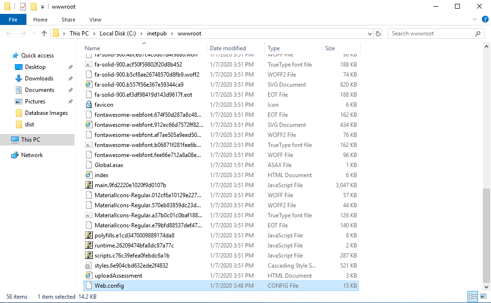

  * The top of the document contains the "ConnectionStrings" section. We will need to edit the "CSET_DB" value to correctly connect to CSET®.
  * In the value for "CSET_DB" there is a part that says “data source=…” You will need to change the part after the equals sign to the IP address or domain name of the machine on which the SQL Server is running.

  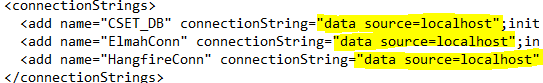

  * If IIS and the SQL Server instance are running on the same machine, you can use “localhost” as the domain name. Otherwise, you will need the specific domain or IP address to connect properly.

  * In the connection string, you will need to update the “Integrated Security=SSPI” section to reflect your SQL Server specific login info.

  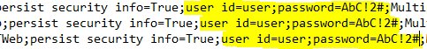
  
  * If you are using the Windows domain authentication method, then you will use “Integrated Security=SSPI” instead of a user ID and password
  
  * If you run into the error "The certificate chain was issued by an authority that is not trusted" when attempting to establish a connection to the database, you can can add this property to the connection string: `Trust Server Certificate=True`

  * Save and close the appsettings.json file.
  * If you receive an error stating that you do not have permissions to save the appsettings.json file, find the file inside the wwwroot folder and right-click on it. Select properties and go into the security tab. Click on the edit button and make sure that all users have “Full Control” over the file.
  * Go back to the “Internet Information Services (IIS) Manager” and on the right, make sure the server is running. You may now browse to your Enterprise CSET® Installation!

### Other Steps (Optional)
### Creating CSET User
There are two ways to add a new user to your freshly created CSET® Stand-Alone. The first way is to register for a new account inside the CSET® application itself. This will require a valid mail host as user’s will be required to enter their email address and receive a confirmation email on your network.

  1.	Using a browser, navigate to your CSET® webpage.
  2.	At right, select “Register New User Account.”
  3.	Enter your information (name, email, and security questions), and select “Register.”
  4.	A confirmation email will be sent to the email you entered. This email will contain a temporary password that will allow you to login to the CSET® Application.
  5.	Once a user has logged in for the first time, they will be prompted to create their own password to replace the temporary one.

The second way to add a new user to your CSET® Application is to use the “AddUser” program. This tool is intended more for testing purposes than company-wide use. It allows anybody to create a new user without the email check and should only be used by administrators. As such, do not place this program in a public or shared folder on your system. This tool can be downloaded from the latest CSET [releases page](https://github.com/cisagov/cset/releases). Simply click on the "AddUser.zip" link to download the file.

  1.	Inside the “AddUser” folder, you will find a file called “AddCSETUser.exe”. It’s a config file. Open this file with a text editor such as notepad. 
  * Inside the "connectionStrings" tags, you will need to change your “data source=” to the IP Address or domain of your server.
  * You will then need to change the “user id=” and “password=” to the admin account you created previously.
  * Save and close the file.
  
  2.	Double-click on the “AddCSETUser” application and a small dialog box should pop-up with entry fields to add a new CSET® User.

  

  * Enter the required information and click “Save.”
  * If you’ve connected with the server properly, you will see small green text at the bottom-left of the box that says, “Added Successfully”. You may now login to CSET® using that user account.

### Mail Host Configuration
1.	Inside “wwwroot\CSETWebApi”, open the appsettings.json file.
  * Inside the config file, you will need to locate the “SMTP Host”, and “Sender Email” portions.

  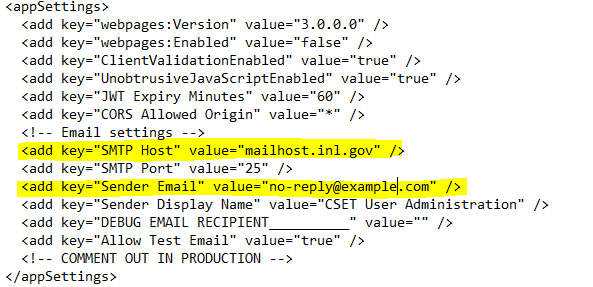

  * Edit the text after the equal sign of value to your domain name. (e.g. value=”mailhost.YOURDOMAIN.com”).
  * Save and close the file when you are finished.

## SSL Security Certificate for Extra Security
An SSL certificate is a web technology that establishes a secure link between a web server and a browser. This link encrypts all data (such as passwords) so that your server is more secure.

  1.	You can follow [this tutorial](https://www.digicert.com/ssl-support/pfx-import-export-iis-7.htm) to add an SSL certificate to your CSET® stand-alone.


## CSET Local Developement Installation Instructions

### Introduction
This documentation is provided to assist users in installing and running CSET locally for development.

### Prerequisites & Necessary Files

1. Windows OS required either via Windows machine or VM
2. Node.js which can be downloaded and installed [here at the node website.](https://nodejs.org/en/download/)
3. Angular 2 for CSETWebApi. You can find local installation [here at the angular website and along with docs.](https://angular.io/guide/setup-local)
4. Git tools for Windows.
5. Visual Studio 2022 (Community Edition is fine) which can be [downloaded here](https://visualstudio.microsoft.com/thank-you-downloading-visual-studio/?sku=Community&rel=16)
6. VS Code which can be [downloaded here.](https://code.visualstudio.com/docs/?dv=win)

Note: VSCode and Visual studio are two diffent IDE's VS Code is used for Front end UI (CSETWebNg) while Visual Studio is used for the backend (CSETWebAPI)

### Installation

1. Clone CSET github repo.
2. Move into project `cd cset`

### Setting up Angular Web UI

Here you can open VSCode and run these commands from the terminal within VSCode.

1. Move to angular folder `cd CSETWebNg`
2. Install packages `npm install` or `npm i`
3. Run server `ng serve`

### Setting up Backend Api

1. Follow Steps above for setting up DB: 
    1. [CSET Enterprise Installation Instructions](https://github.com/cisagov/cset#cset-enterprise-installation-instructions)
    2. [SQL Server Installation](https://github.com/cisagov/cset#sql-server-installation)
    3. [Firewall Configuration](https://github.com/cisagov/cset#firewall-configuration)
    4. [Database Setup](https://github.com/cisagov/cset#database-setup)
    5. [Create Database User](https://github.com/cisagov/cset#create-database-user)
2. Open CSET with Visual Studio.
3. Select `CSETWeb_Api.sin` for project file.
4. Open `appsettings.json` in the CSETWebCore.Api project and change the settings in `connectionStrings` according to [CSET Configuration](https://github.com/cisagov/cset#cset-configuration).
5. Build solution and run within Visual Studio by selecting the play button on the top with "CSETWeb_ApiCore" selected.

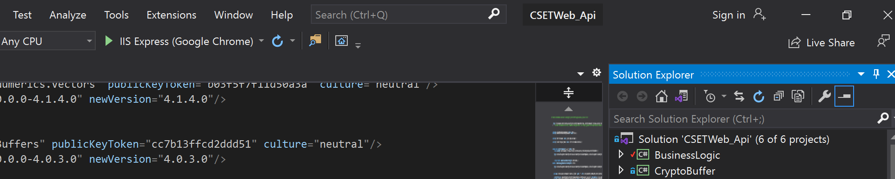 

<br>

This will open a window in the default web browser to confirm that the db is connected.

## Trouble shooting Dev installation

### Issues running `ng serve`

1. Delete `node_modules`
2. clear cache `npm cache clear --force`
3. reinstall packages `npm install`
4. rerun server `ng serve`

Package issues when running `ng serve`

Example: When Atampting to run the server, there is a issue that presents such as:

```bash
SyntaxError: Unexpected token 'if'
```

or when inspected via a log file:

```bash
[error] /Users/bob/projects/cset/CSETWebNg/node_modules/lodash/lodash.js:3980
        if ((key === '__proto__' || key === 'constructor' || key === 'prototype')) {
        ^^
SyntaxError: Unexpected token 'if'
    at wrapSafe (internal/modules/cjs/loader.js:1053:16)
    at Module._compile (internal/modules/cjs/loader.js:1101:27)
    ...
```

Here the issue is with the package seen: `lodash`

To fix this simplie run `npm install --save lodash`

After installing, rerun server `ng serve`

To run production locally:

Copy values from:

```bash
../cset/CSETWebNg/src/environments/environment.ts
```

into

```bash
../cset/CSETWebNg/src/environments/environment.prod.ts
```

with `production: true`

then run `ng serve --prod`

### Error within compiling server

Moustrap Error:

When compiling, an error shows:

```bash
ERROR in node_modules/angular2-hotkeys/lib/hotkeys.service.d.ts:10:16 - error TS2304: Cannot find name 'MousetrapInstance'.
10     mousetrap: MousetrapInstance;
                  ~~~~~~~~~~~~~~~~~
** Angular Live Development Server is listening on localhost:4200, open your browser on http://localhost:4200/ **
70% building 504/504 modules 0 active    
    ERROR in node_modules/angular2-hotkeys/lib/hotkeys.service.d.ts:10:16 - error TS2304: Cannot find name 'MousetrapInstance'.
    10     mousetrap: MousetrapInstance;

```

Fix: open file location at `node_modules/angular2-hotkeys/lib/hotkeys.service.d.ts` and fix the line where

```typescript
mousetrap: MousetrapInstance;
```

to

```typescript
mousetrap: Mousetrap.MousetrapInstance;
```

### Issues Running CSETWebApi

CSETWebApi not building.

On right side of Visual Studio, check under resorces for missing and un updated packages. 

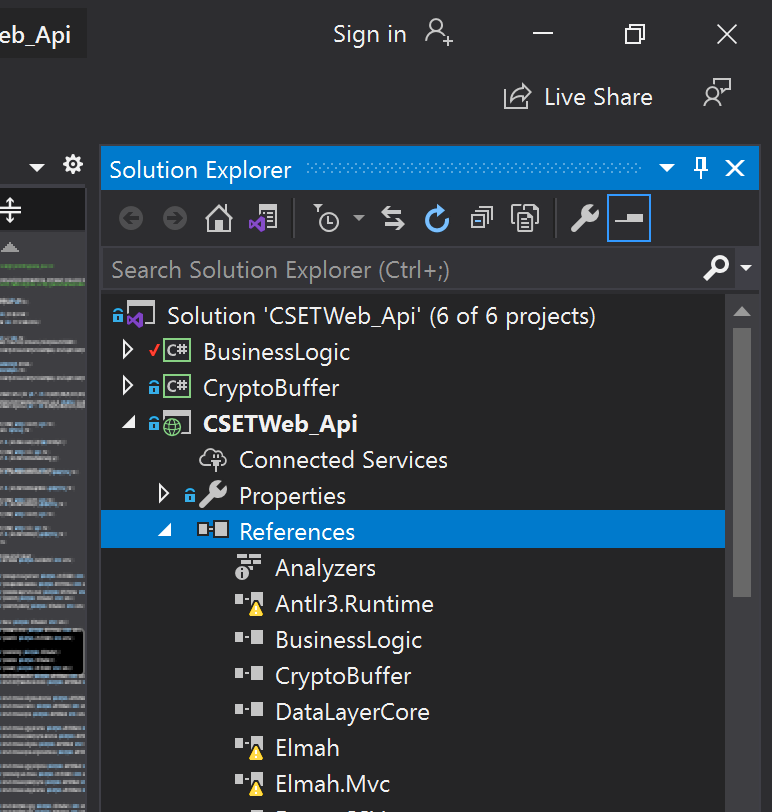 
 
 
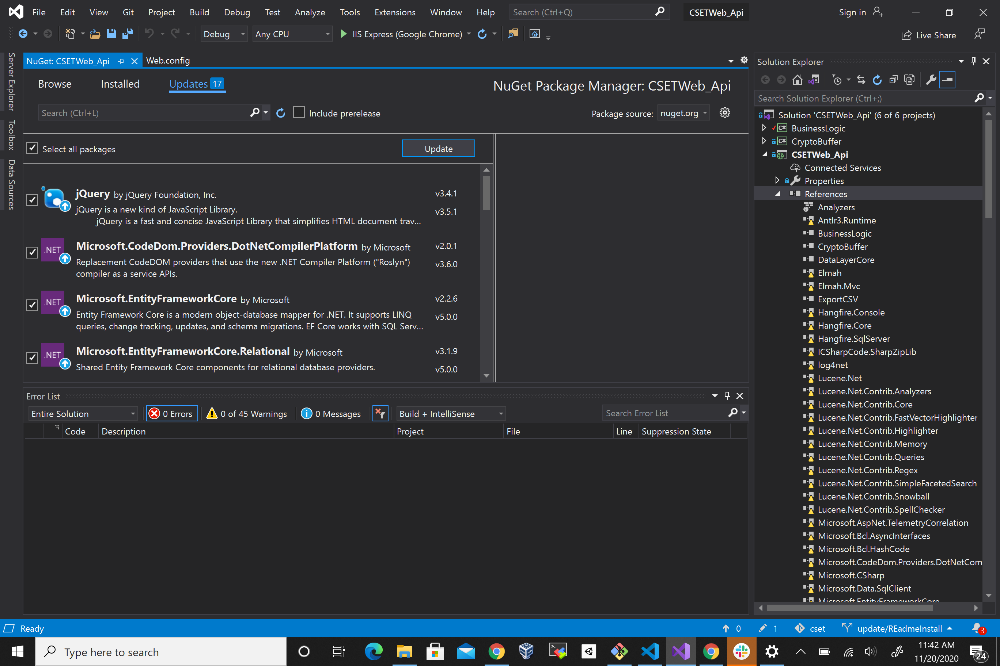 

reimport and updarte packages as needed.
recompile as needed. 

### CSETWebApi runs but cannot connect to DB

Within `ConnectionStrings` in `appsettings.json` check if creds are set correctly, for local db, the connetion string would look as follows.

```config
{
  "ConnectionStrings": {
    "CSET_DB": "data source=localhost;user id=user;password=password;initial catalog=CSETWeb;persist security info=True;MultipleActiveResultSets=True;"
  }
```

These settings will connect to a SQL DB running on `localhost` with created user: `user` with password: `password`. 

Double check [CSET Configuration](https://github.com/cisagov/cset#cset-configuration) above for configuration.
