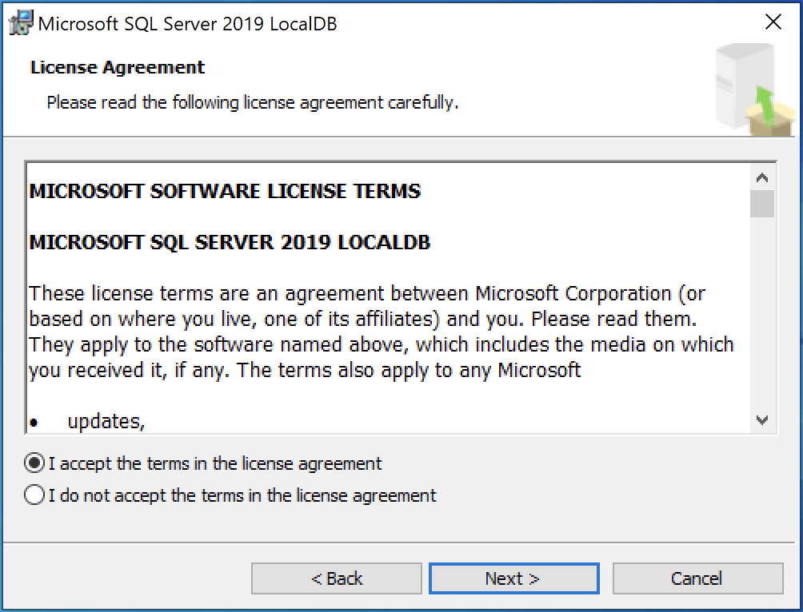
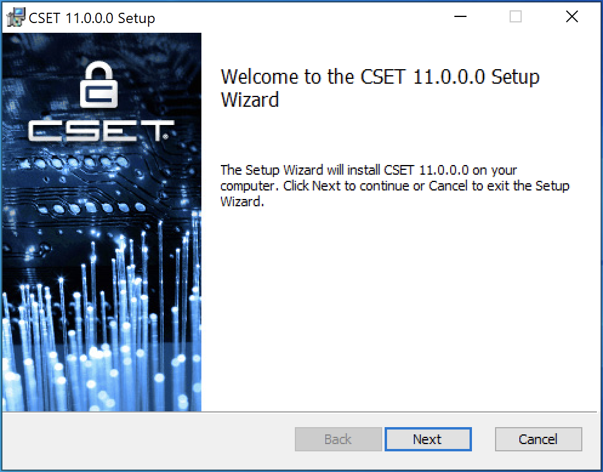
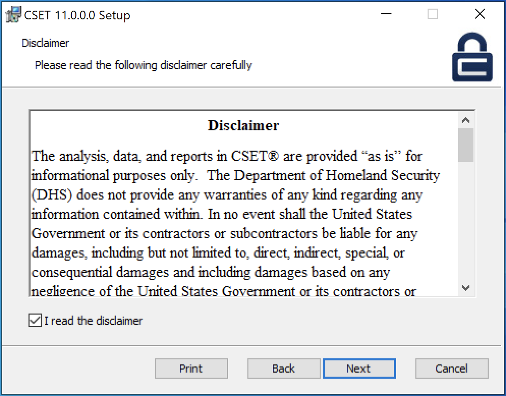
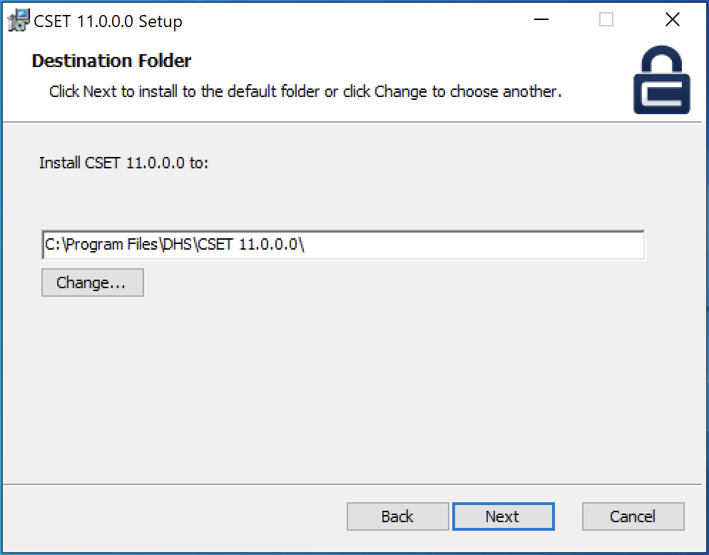
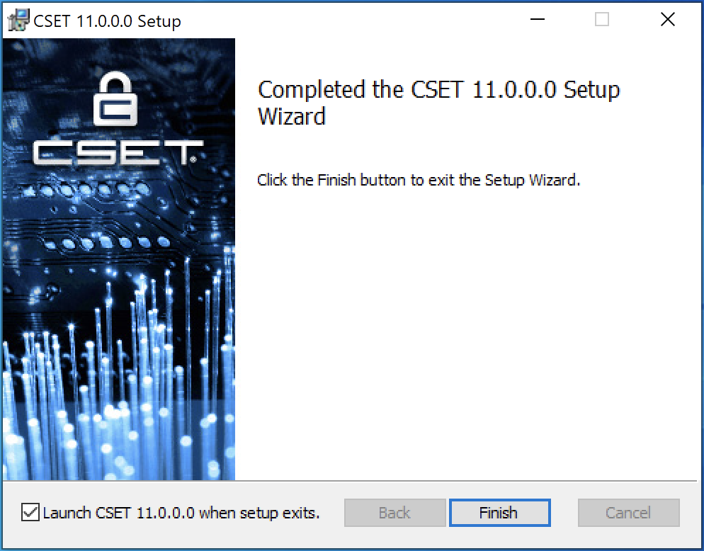
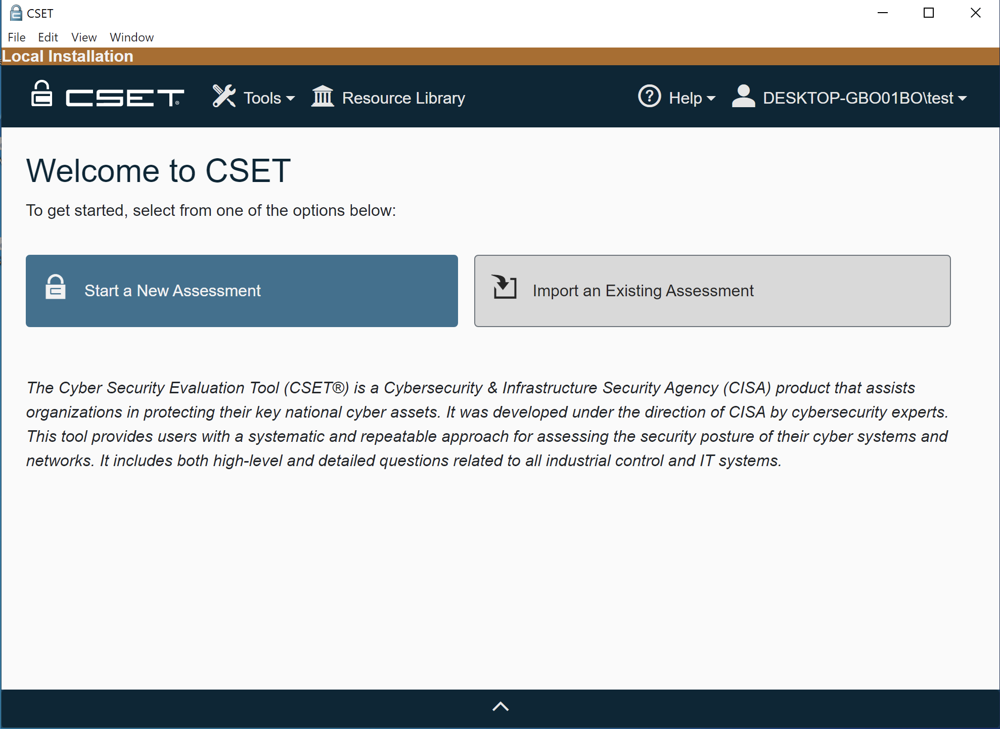

# Using the CSET Standalone Installer

The installer will add everything needed to run CSET on a self-contained Windows computer.  The front- and back-end components
and database are all installed on the local machine.

## Install Process
Double-click on the CSETStandAlone program.

The User Account Control dialog will appear (Fig.1). Select &quot;Yes&quot;.

**Figure 1: User Account Control Box**

A CSET dialog will open asking if you want to install the CSET Desktop (Fig.2). Select &quot;Yes&quot;.

**Figure 2: Install Dialog**

The program will begin extracting.

After the extraction is finished, a CSET Setup dialog will open (Fig.3). Select &quot;Install&quot;.

**Figure 3. CSET Setup**

CSET will begin to install. If the user doesn&#39;t have SQL Server 2022 LocalDB, CSET will install it. The SQL Server 2022 LocalDB Setup dialog will open (Fig.4). Click the check box to confirm that you &quot;…accept the terms in the License Agreement&quot;, select &quot;Next&quot;, and then select &quot;Install&quot;.

 
**Figure 4. LocalDB 2022 Setup**

LocalDB 2022 will install. Select &quot;Finish&quot; when it completes.

CSET will also install the .NET 7 and ASP.NET Core 7 runtimes in the background if they are not already installed.

The CSET Setup Wizard will open to walk the user through the install process (Fig.5). Select &quot;Next&quot;.

**Figure 5: Setup Wizard**

A disclaimer will open (Fig.6). Read through and then click the box &quot;I read the disclaimer&quot;, and select &quot;Next&quot;.

 
**Figure 6: Disclaimer**

CSET will choose a default folder to install CSET to, but you can change this in the Destination Folder dialog (Fig.7). Select &quot;Next&quot;.

 
**Figure 7: Destination Folder**

The CSET Installer will show that it is ready to install (Fig. 8). Select &quot;Install&quot;.

 
**Figure 8: Ready to Install**

The installation of the main CSET application will begin. Once the installation is finished, the completed CSET Setup Wizard dialog will appear. Make sure the &quot;Launch CSET when setup exists&quot; box is checked, and select &quot;Finish&quot;.

 
**Figure 9: Completed CSET Setup Wizard**

The user should see a setup successful dialog (Fig.10).

 
**Figure 10: Setup Successful**

The user has access to CSET as Local User. The Local Installation ribbon is visible at the top of the screen. They can see their landing page with no assessments at this time (Fig.11).

Figure 11: Local Install Landing Page

