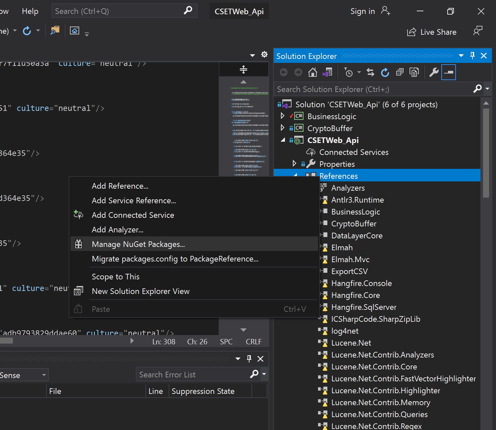
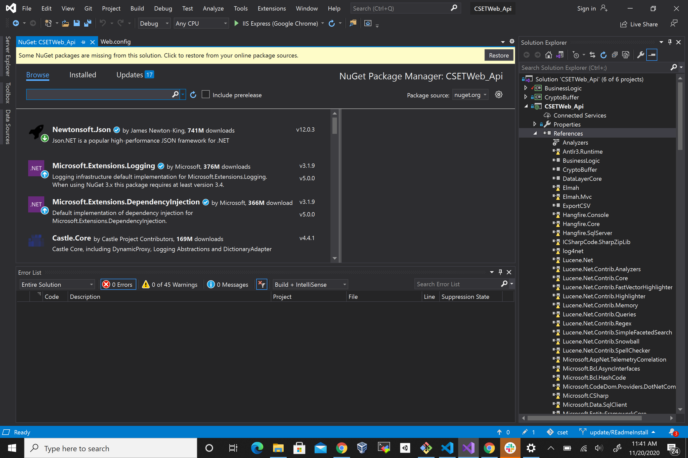

# Troubleshooting During Development

Here are a few issues that may present themselves to developers.

## Issues running `ng serve`

1. Delete `node_modules`
2. clear cache `npm cache clear --force`
3. reinstall packages `npm install`
4. rerun server `ng serve`

Package issues when running `ng serve`

Example: When attempting to run the server, there is a issue that presents such as:

```bash
SyntaxError: Unexpected token 'if'
```

or when inspected via a log file:

```bash
[error] /Users/bob/projects/cset/CSETWebNg/node_modules/lodash/lodash.js:3980
        if ((key === '__proto__' || key === 'constructor' || key === 'prototype')) {
        ^^
SyntaxError: Unexpected token 'if'
    at wrapSafe (internal/modules/cjs/loader.js:1053:16)
    at Module._compile (internal/modules/cjs/loader.js:1101:27)
    ...
```

Here the issue is with the package seen: `lodash`

To fix this simply run: `npm install --save lodash`

After installing, rerun server: `ng serve`

To run production locally:

Copy values from

```bash
../cset/CSETWebNg/src/environments/environment.ts
```

into

```bash
../cset/CSETWebNg/src/environments/environment.prod.ts
```

with `production: true`

then run `ng serve --prod`


## Error within compiling server

Mousetrap Error:

When compiling, an error shows:

```bash
ERROR in node_modules/angular2-hotkeys/lib/hotkeys.service.d.ts:10:16 - error TS2304: Cannot find name 'MousetrapInstance'.
10     mousetrap: MousetrapInstance;
                  ~~~~~~~~~~~~~~~~~
** Angular Live Development Server is listening on localhost:4200, open your browser on http://localhost:4200/ **
70% building 504/504 modules 0 active    
    ERROR in node_modules/angular2-hotkeys/lib/hotkeys.service.d.ts:10:16 - error TS2304: Cannot find name 'MousetrapInstance'.
    10     mousetrap: MousetrapInstance;

```

Fix: open file location at `node_modules/angular2-hotkeys/lib/hotkeys.service.d.ts` and fix the line where

```typescript
mousetrap: MousetrapInstance;
```

to

```typescript
mousetrap: Mousetrap.MousetrapInstance;
```

## Issues Running CSETWebApi

CSETWebApi not building.

In the Visual Studio Solution Explorer, check under References for missing and out-of-date packages. 


<br>
<br>


<br>
<br>

 
<br>
<br>

 
<br>
<br>

Reimport and update packages as needed.
Recompile as needed. 


## CSETWebApi runs but cannot connect to DB

Within `ConnectionStrings` in `appsettings.json` check if credentials are set correctly. For local db, the connection string would look as follows.

```config
  "ConnectionStrings": {
    "CSET_DB": "data source=localhost;user id=user;password=password;initial catalog=CSETWeb;persist security info=True;MultipleActiveResultSets=True;"
  }
```

These settings will connect to a SQL DB running on `localhost` with created user: `user` with password: `password`. 

Double check [CSET Configuration](enterprise_install.md#cset-configuration) for configuration.