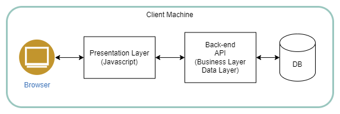

# CSET Installation Options

CSET can be installed in one of several configurations.  

In this documentation, the client-server configuration is refered to as an "Enterprise Installation".
When CSET is installed to run on an individual self-contained computer it is called "Standalone."

[Using the Standalone Installer](stand_alone_install.md)

[CSET Enterprise Installation Instructions](enterprise_install.md)

[CSET Local Development Installation Instructions](local_dev_install.md)

[Troubleshooting During Development](trouble_shooting_dev.md)

## Comparison: Standalone vs Enterprise

Following is a brief explanation of the main differences between the two configurations.

### Standalone or "local installation"

- The configuration that is most often run among the CSET user base.  
- The installer can be downloaded from [cset releases](https://github.com/cisagov/cset/releases/)
- The user interface, server and database components are all installed on the target computer.
- Because the database instance is local to the target machine, the data is not visible or shared with any entity.  The user must deliberately export an assessment to a file to share it.
- Does not require a login/password.  CSET recognizes that the installation is “local” and authenticates the user with their Windows account credentials.  
The UI asks the API if it is a “local installation”, which is controlled by the existence of a LOCAL-INSTALLATION (no extension) file in the API's runtime folder.  
The user is immediately granted access to CSET and does not need to login.

### Enterprise Installation

- A true client-server configuration.	
- The back-end API runs on a common web server.  This may be on a cloud server facing the public internet or on a private intranet server.  The API is the business server.
- The UI is configured to talk to the common API.  All users will use the shared API and shared database.  
- The UI files are deployed on a web server also, but it can be different from the server hosting the API.  The CSET UI is built in Angular and consists of Javascript file bundles and other static resources such as stylesheets and images.
- The user does not need to install anything.  CSET runs as a pure web application.  
- Users must register to get an account.  
- Assessments are segregated by user. A CSET user can only see assessments that they created or have been invited to participate in.  The list of assessments they see does not show other users’ work.

