[← Back to Installation Options](README.md)

# Using the CSET Standalone Installer

The installer will add everything needed to run CSET on a self-contained Windows computer.  The front- and back-end components
and database are all installed on the local machine.

## Install Process
Double-click on the CSETStandAlone program.

The User Account Control dialog will appear (Fig.1). Select &quot;Yes&quot;.

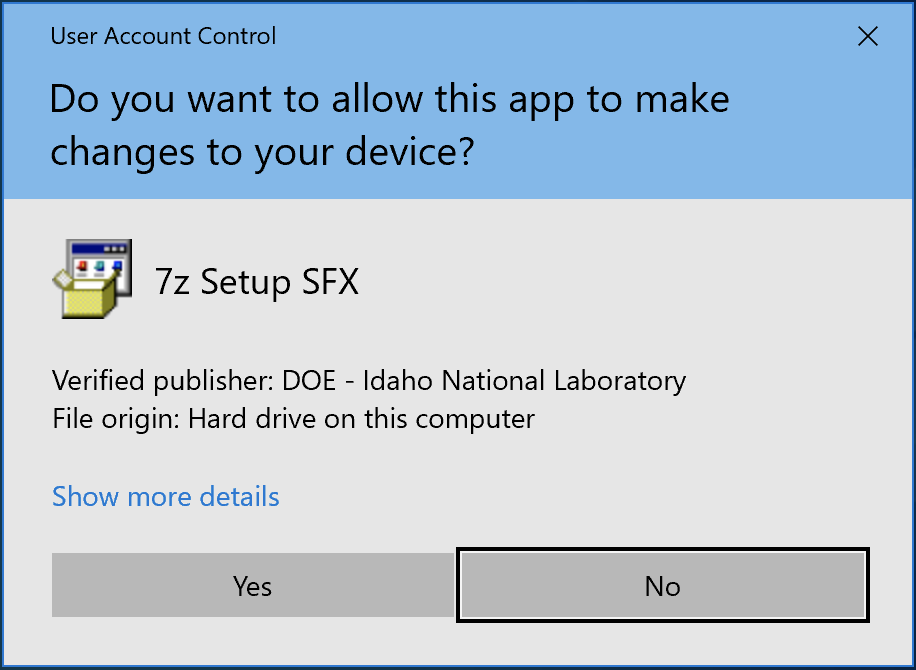

**Figure 1: User Account Control Box**

A CSET dialog will open asking if you want to install the CSET Desktop (Fig.2). Select &quot;Yes&quot;.

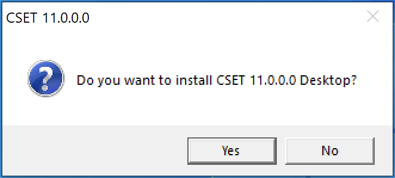

**Figure 2: Install Dialog**

The program will begin extracting.

After the extraction is finished, a CSET Setup dialog will open (Fig.3). Select &quot;Install&quot;.

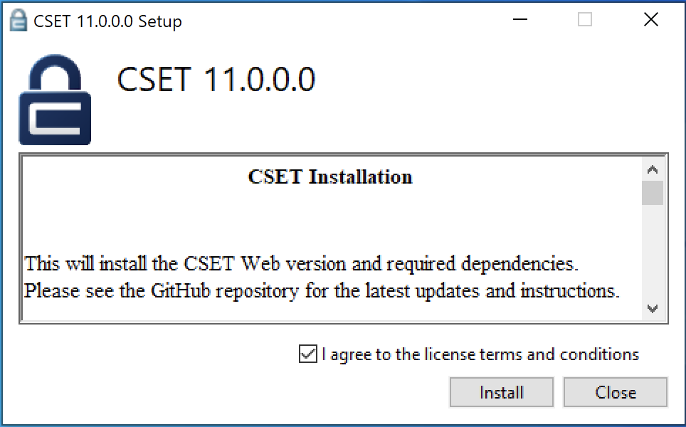

**Figure 3. CSET Setup**

CSET will begin to install. If the user doesn&#39;t have SQL Server 2022 LocalDB, CSET will install it. The SQL Server 2022 LocalDB Setup dialog will open (Fig.4). Click the check box to confirm that you &quot;…accept the terms in the License Agreement&quot;, select &quot;Next&quot;, and then select &quot;Install&quot;.

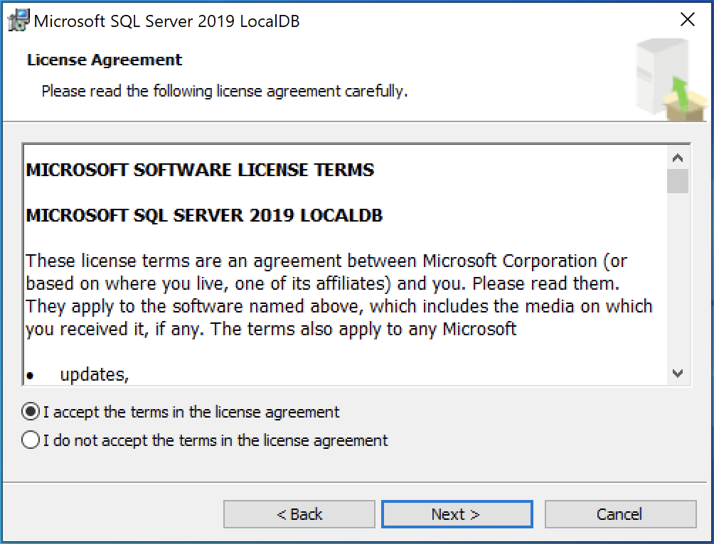
 
**Figure 4. LocalDB 2022 Setup**

LocalDB 2022 will install. Select &quot;Finish&quot; when it completes.

CSET will also install the .NET 7 and ASP.NET Core 7 runtimes in the background if they are not already installed.

The CSET Setup Wizard will open to walk the user through the install process (Fig.5). Select &quot;Next&quot;.

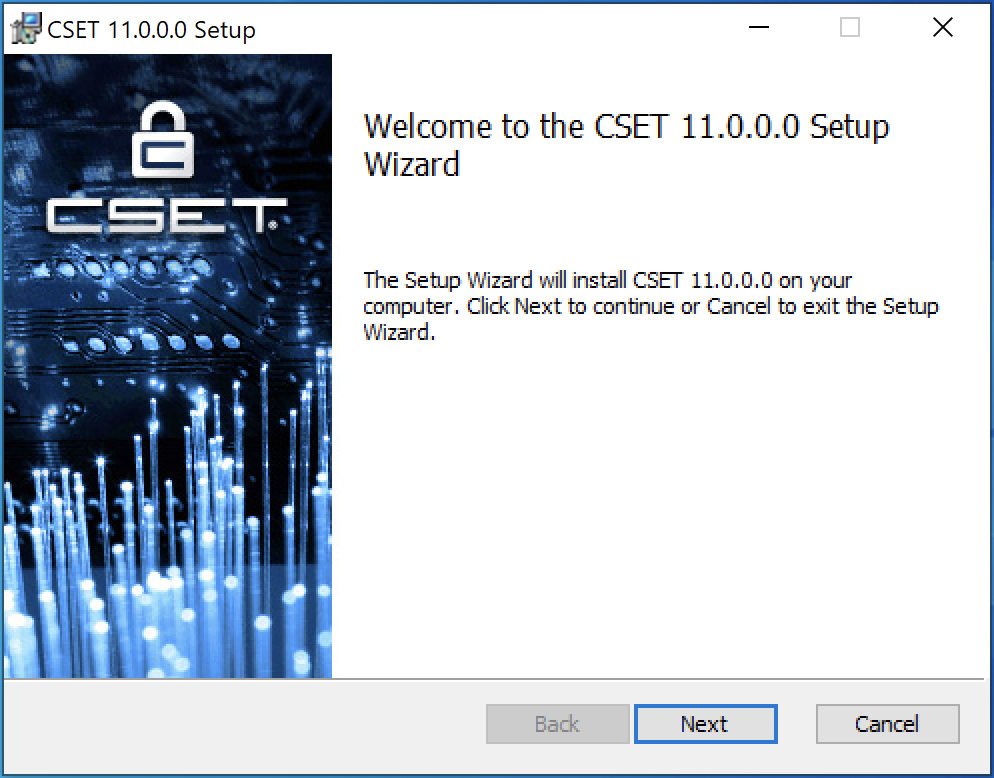

**Figure 5: Setup Wizard**

A disclaimer will open (Fig.6). Read through and then click the box &quot;I read the disclaimer&quot;, and select &quot;Next&quot;.

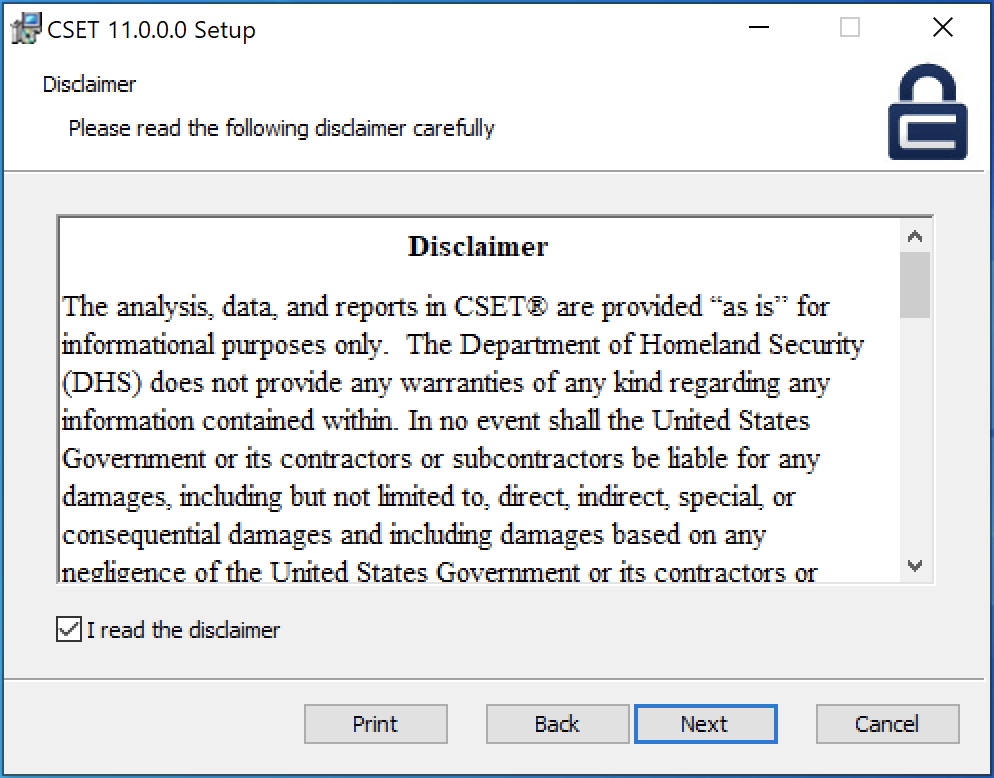
 
**Figure 6: Disclaimer**

CSET will choose a default folder to install CSET to, but you can change this in the Destination Folder dialog (Fig.7). Select &quot;Next&quot;.

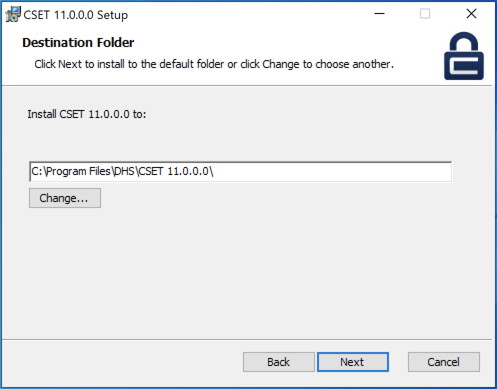
 
**Figure 7: Destination Folder**

The CSET Installer will show that it is ready to install (Fig. 8). Select &quot;Install&quot;.

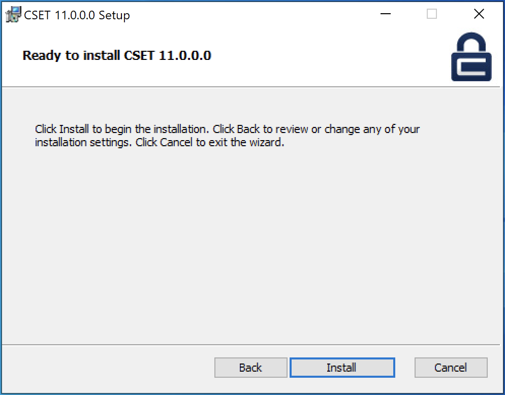
 
**Figure 8: Ready to Install**

The installation of the main CSET application will begin. Once the installation is finished, the completed CSET Setup Wizard dialog will appear. Make sure the &quot;Launch CSET when setup exists&quot; box is checked, and select &quot;Finish&quot;.

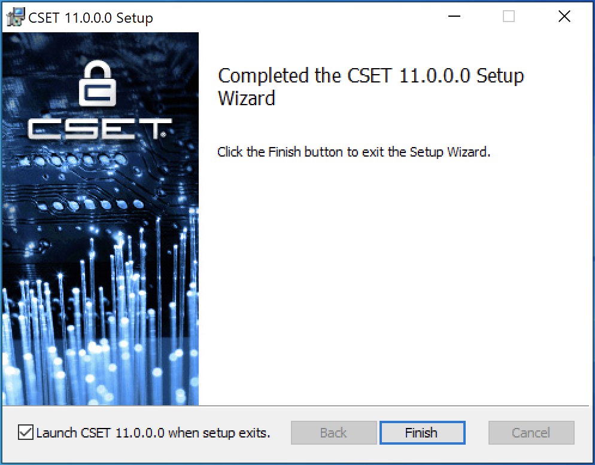
 
**Figure 9: Completed CSET Setup Wizard**

The user should see a setup successful dialog (Fig.10).

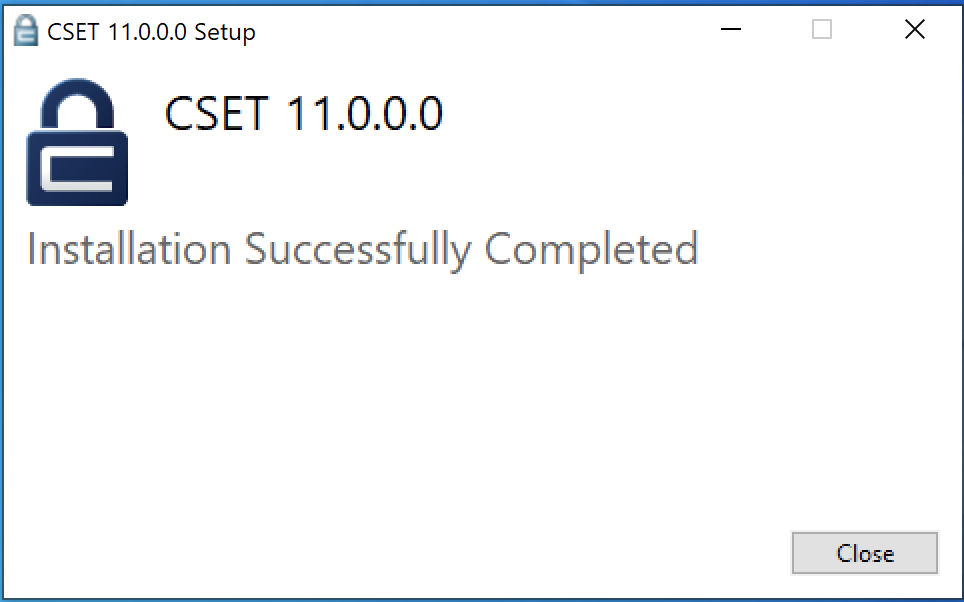
 
**Figure 10: Setup Successful**

The user has access to CSET as Local User. The Local Installation ribbon is visible at the top of the screen. They can see their landing page with no assessments at this time (Fig.11).

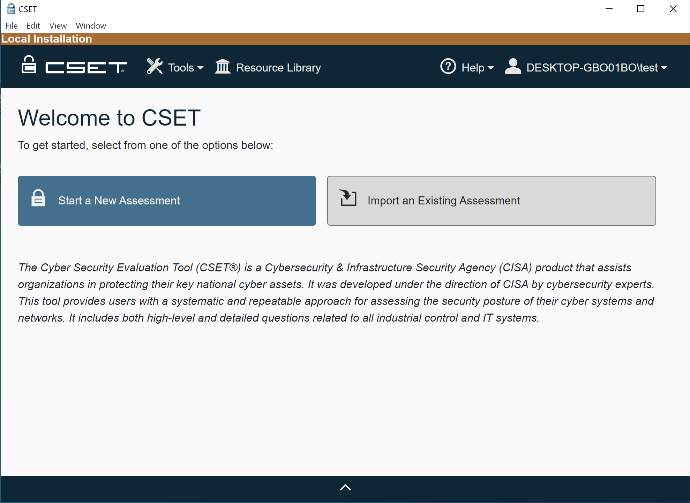

Figure 11: Local Install Landing Page

## Other Steps (Optional)
### Creating CSET User
There are two ways to add a new user to your freshly created CSET® Stand-Alone. The first way is to register for a new account inside the CSET® application itself. This will require a valid mail host as user’s will be required to enter their email address and receive a confirmation email on your network.

  1.	Using a browser, navigate to your CSET® webpage.
  2.	At right, select “Register New User Account.”
  3.	Enter your information (name, email, and security questions), and select “Register.”
  4.	A confirmation email will be sent to the email you entered. This email will contain a temporary password that will allow you to login to the CSET® Application.
  5.	Once a user has logged in for the first time, they will be prompted to create their own password to replace the temporary one.

The second way to add a new user to your CSET® Application is to use the “AddUser” program. This tool is intended more for testing purposes than company-wide use. It allows anybody to create a new user without the email check and should only be used by administrators. As such, do not place this program in a public or shared folder on your system. This tool can be downloaded from the latest CSET [releases page](https://github.com/cisagov/cset/releases). Simply click on the "AddUser.zip" link to download the file.

  1.	Inside the “AddUser” folder, you will find a file called “AddCSETUser.exe”. It’s a config file. Open this file with a text editor such as notepad. 
  * Inside the "connectionStrings" tags, you will need to change your “data source=” to the IP Address or domain of your server.
  * You will then need to change the “user id=” and “password=” to the admin account you created previously.
  * Save and close the file.
  
  2.	Double-click on the “AddCSETUser” application and a small dialog box should pop-up with entry fields to add a new CSET® User.

  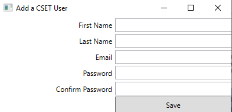

  * Enter the required information and click “Save.”
  * If you’ve connected with the server properly, you will see small green text at the bottom-left of the box that says, “Added Successfully”. You may now login to CSET® using that user account.
  